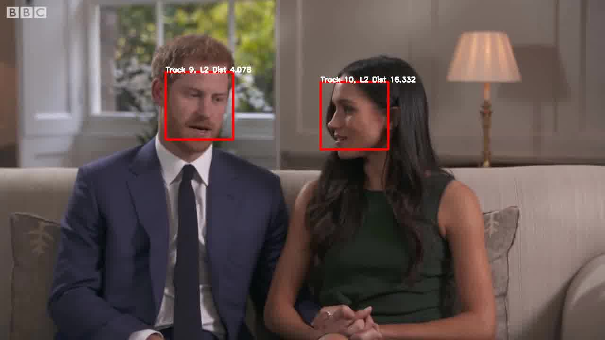
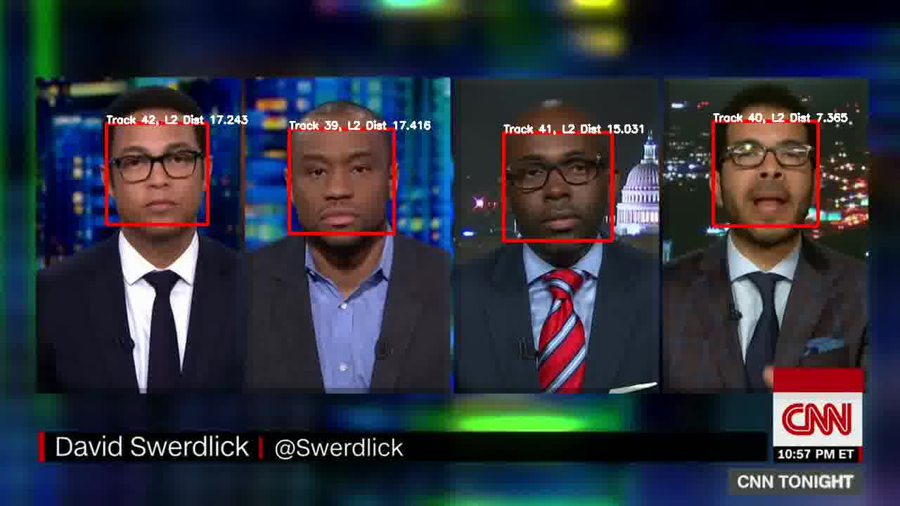

# SyncNet

This repository contains the demo for the audio-to-video synchronisation network (SyncNet). This network can be used for audio-visual synchronisation tasks including: 
1. Removing temporal lags between the audio and visual streams in a video;
2. Determining who is speaking amongst multiple faces in a video. 

Please cite the paper below if you make use of the software. 

## Dependencies
```
pip install -r requirements.txt
```

In addition, `ffmpeg` is required.


## Demo

SyncNet demo:
```
python demo_syncnet.py --videofile data/example.avi --tmp_dir /path/to/temp/directory
```

Check that this script returns:
```
AV offset:      3 
Min dist:       5.353
Confidence:     10.021
```

Full pipeline:
```
sh download_model.sh
python run_pipeline.py --videofile /path/to/video.mp4 --reference name_of_video --data_dir /path/to/output
python run_syncnet.py --videofile /path/to/video.mp4 --reference name_of_video --data_dir /path/to/output
python run_visualise.py --videofile /path/to/video.mp4 --reference name_of_video --data_dir /path/to/output
```

Outputs:
```
$DATA_DIR/pycrop/$REFERENCE/*.avi - cropped face tracks
$DATA_DIR/pywork/$REFERENCE/offsets.txt - audio-video offset values
$DATA_DIR/pyavi/$REFERENCE/video_out.avi - output video (as shown below)
```
<p align="center">
  
  
</p>

## Publications
 
```
@InProceedings{Chung16a,
  author       = "Chung, J.~S. and Zisserman, A.",
  title        = "Out of time: automated lip sync in the wild",
  booktitle    = "Workshop on Multi-view Lip-reading, ACCV",
  year         = "2016",
}
```
